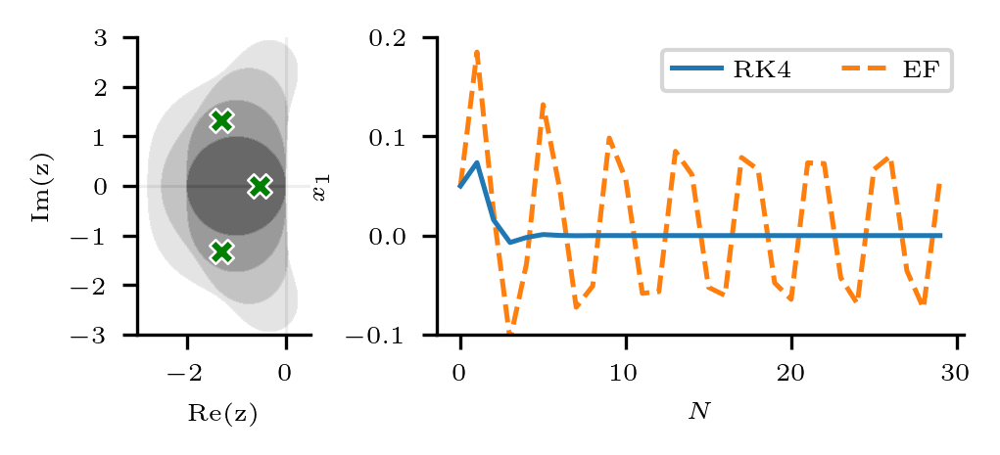

# Stability-Informed Initialization of Neural Ordinary Differential Equations

[//]: # (> ### Updates)

[//]: # (>  *November 2023* :date:)

[//]: # (> - First commit.)

> ### Description
> _neural-stability_ is a library containing the implementations for the paper: 
> - *Stability-Informed Initialization of Neural Ordinary Differential Equations*
> 
> The paper is available in preprint format on [[arxiv]](https://arxiv.org/abs/2311.15890).
> All code is written using Python 3.11 using [PyTorch](https://pytorch.org/) and [Lightning](https://pytorch-lightning.readthedocs.io/en/latest/).
> Numerical integration is performed using [torchdiffeq](https://github.com/rtqichen/torchdiffeq).

<p align="center">
  
  <br>
  <em>Figure 1: The figure depicts the approximate eigenvalues (green crosses) of a nonlinear system (neural network) and the simulated response to a small perturbation using a 4th-order Runge-Kutta (RK4) and EF method. The connection between solver stability regions (shown on the left) and the performance of neural ODEs is central to the paper and the proposed initialization technique.</em>
</p>


##### If you found the content of this repository useful, please consider citing the paper in your work:
```
@article{westny2023stability,
title="Stability-Informed Initialization of Neural Ordinary Differential Equations",
author={Westny, Theodor and Mohammadi, Arman and Jung, Daniel and Frisk, Erik},
journal={arXiv preprint arXiv:2311.15890},
year={2023}}
```
***

#### Hardware requirements

Depending on the experiment at hand, the original implementation make use of a considerable amount of data (some gigabytes worth) for training and testing which can be demanding for some setups.
For you reference, all code has been tried and tested on a computer with the following specs:
```
* Processor: Intel® Xeon(R) E-2144G CPU @ 3.60GHz x 8
* Memory: 32 GB
* GPU: NVIDIA Corporation TU102 [GeForce RTX 2080 Ti Rev. A]
```

## Usage

All experiments presented in the paper are contained within their respective foldes, e.g., 'Latent Dynamics' is in the folder `latent_dynamics`.
To implement the stability-informed initialization technique, the main files of interest are:
- [stb_init.py](stb_init.py)
- [neuralode.py](models/neuralode.py)

In `stb_init.py` the initialization technique implementation as outlined in the paper is contained.
In its current form, the function that initializes the parameters of the provided model assumes the neural network is implemented using the `Sequential` module form `torch.nn`.

In `neuralode.py`, you will find the implementations of a template neural network. 
This is also where you will find functions used to perform the Jacobian calculations of the model in order to estimate model eigenvales.

In this work, [lightning](https://pytorch-lightning.readthedocs.io/en/latest/) was used to implement the training and testing behavior.
Since most of the functionality is still implemented using pytorch, you are not restricted to using lightning, but it is recommended given the additional functionality.
In the various `base_[experiment].py` files, the lightning-based abstractions for the different experiments are contained.
These modules are used to implement batch-wise forward and backward passes as well as to specify training and testing behavior.

Assuming data is available, conducting an experiment can be done using the `train.py` file with a pointer to a configuration file in an environment with the necessary libraries installed, e.g.:
```bash
python train.py --config "spring.json"
```
which will execute the training procedure for the latent dynamics model of the spring-mass system.
For your convenience, we have prepared several `[experiment].json` files with the specific set arguments for the respective experiments.
These can be found in the `configs` folder.
Note that there are some arguments that are not included in the configuration files, e.g., `--use-cuda` and `--n-workers` that you need to specify yourself based on your setup.

### Containerized Development
To simplify the process of running the experiments, we have provided [Apptainer](https://apptainer.org/) and [Docker](https://www.docker.com/) images that contains all the necessary libraries and dependencies.
Using the provided images, you can run the experiments in a containerized environment without having to worry about installing the necessary libraries.

#### Apptainer
Start by building the image (inside the `container` folder):
```bash
apptainer build apptainer.sif apptainer.def
```
Next, from inside the repository root folder you can run the experiments using commands like:
```bash
apptainer exec --nv apptainer.sif --config "spring.json"
```
where `--nv` is used to enable GPU support.

#### Docker
Start by building the image (inside the `container` folder):
```bash
docker build -t neural_stability .
```
Next, from inside the repository root folder you can run the experiments using commands like:
```bash
docker run --gpus all docker run -v $(pwd):/app -w /app neural_stability python train.py --config "spring.json"

```
where `--gpus all` is used to enable GPU support.

## Datasets

For model training and evaluation, several different data sets were used.
The data sets used in this work are not included in this repository and must be obtained separately.
For all experiments, we provide the necessary code to download and preprocess the data sets.

### Sequential Vision
For the sequential classification tasks, [MNIST](http://yann.lecun.com/exdb/mnist/) and [CIFAR-10](https://www.cs.toronto.edu/~kriz/cifar.html) are directly available through the [torchvision](https://pytorch.org/) library.
The download and preprocessing of the data sets are handled through the provided code.

<p align="center">
   <!-- Added margin-right -->
     <!-- Added margin-right -->
  
  <br>
  <em>Figure 2: The leftmost figure showcases sample data from the MNIST dataset, the central figure presents samples from the permuted MNIST dataset, and the rightmost figure depicts sample data from the CIFAR-10 dataset.</em>
</p>

### Latent Dynamics
For the latent dynamics benchmarks introduced in ([Botev et al., 2021](https://arxiv.org/abs/2111.05458)), the data sets are available through the paper-provided [link](https://console.cloud.google.com/storage/browser/dm-hamiltonian-dynamics-suite) (also noted in our code).
We have additionally provided the functionality to download the data sets directly using the code should you wish to do so.
Importantly, the data sets in their original format (`.tfrecord`) are not easily used with pytorch.
Therefore, we have provided a preprocessing script that converts the data sets into `.hdf5` format.
The script is available in the `latent_dynamics` folder and is named `tf_converter_hdf5.py`.
It requires a single argument, which is the dataset of interest, e.g.:
```bash
python tf_converter_hdf5.py --dataset "spring"
```
A word of caution, the final data sets are quite large (several gigabytes) as opposed to the original .tfrecord files but we found that these worked best for our purposes.

<p align="center">
  
  <br>
  <em>Figure 3: This figure provides a visual representation of the four datasets introduced in (Botev et al., 2021) that were used in the paper: the Spring-mass system (Mass Spring), the Double Pendulum, Molecular Dynamics (16 particles), and the 3D Room (comprised of MuJoCo scenes). Notably, the Spring-mass system is depicted in grey-scale solely for visual clarity, to distinguish it more easily from the other datasets presented.</em>
</p>

### Multivariate Time-Series Forecasting
The forecasting study utilizes three distinct datasets, briefly described below.

#### Combustion Engine Dynamics
For the combustion engine dataset, we used the _no-fault_ data from the [LiU-ICE Industrial Fault Diagnosis Benchmark](https://vehsys.gitlab-pages.liu.se/diagnostic_competition/) available at [[download link]](https://vehsys.gitlab-pages.liu.se/diagnostic_competition/competition/training_data/trainingdata.zip).
The model is tasked with predicting the intercooler pressure using the other available measurements as inputs (except temperature).
Upon execution, the code will download the dataset and preprocess it by default.
The complete dataset is quite small (a few MBs), and the preprocessing is quick.

<p align="center">
   <!-- Added margin-right -->
  
  <br>
  <em>Figure 3: The figure on the left depicts the schematic of the air path through the engine (test bench shown on the right).</em>
</p>

#### Localization Data for Person Activity
The Human Activity dataset is available through the [UCI Machine Learning Repository](https://archive.ics.uci.edu/dataset/196/localization+data+for+person+activity).
Data contains recordings of five people performing different activities.
Each person wore four sensors (tags) while performing the same scenario five times.
The input data to the model consist of the (x,y,z) recordings from three of the four tags (ankle left, ankle right, and belt).
The measurements belonging to the final tag (chest) are used as the ground truth target.
The data set is available in `.txt` format and is preprocessed using the provided code. 
The use of the activity dataset was inspired by the work of ([Rubanova et al., 2019](https://arxiv.org/abs/1907.03907)).
<p align="center">
  
  <br>
  <em>Figure 3: Visualization of the data provided in the Human Activity dataset for subject A01.</em>
</p>

#### Air Quality
The Air Quality dataset is available through the [UCI Machine Learning Repository](https://archive.ics.uci.edu/dataset/360/air+quality).
It contains the responses of a gas multisensor device deployed on the field in an Italian city. Hourly responses averages are recorded along with gas concentrations references from a certified analyzer.
The task associated with this dataset is a little different from the other two.
Taking in the measurements of the gas multisensor device, the model is tasked with predicting the gas concentrations references from the certified analyzer.
For simplicity, we remove Non Metanic HydroCarbons (NMHC(GT)) from the data set as it contains a lot of missing values.
For the remaining features, we use linear interpolation to fill in the missing values.
The data set is available in `.csv` and `.xlxs` format (we use `.xlxs` ) and is preprocessed using the provided code.

<p align="center">
  
  <br>
  <em>Figure 3: Visualization of the data provided in the Air Quality dataset.</em>
</p>

## License
[Creative Commons](https://creativecommons.org/licenses/by-sa/4.0/)

## Inquiries
> Questions about the paper or the implementations found in this repository should be sent to [_theodor.westny [at] liu.se_](https://liu.se/en/employee/thewe60).
