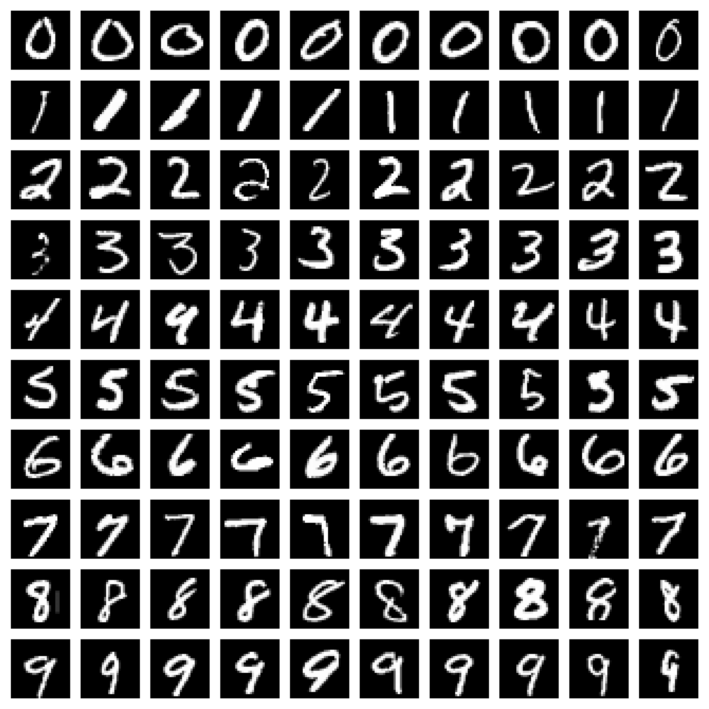
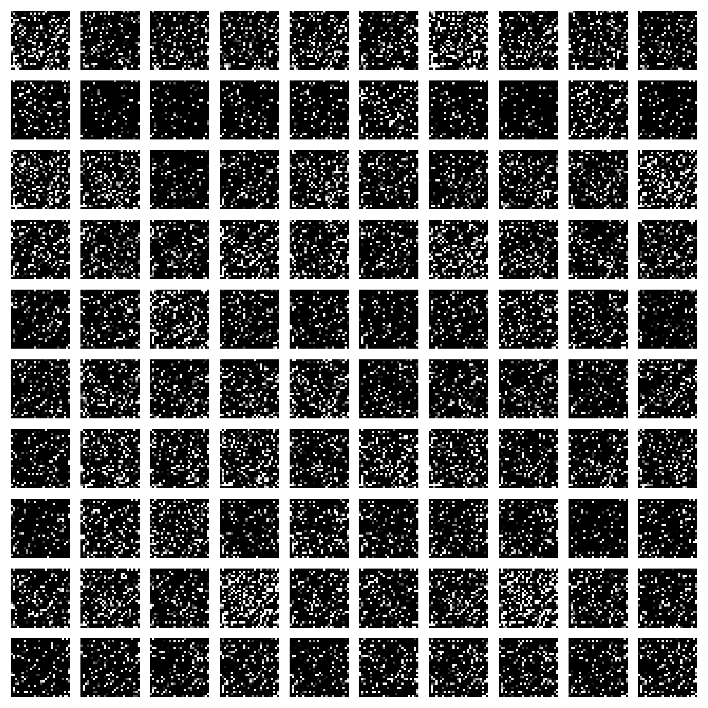
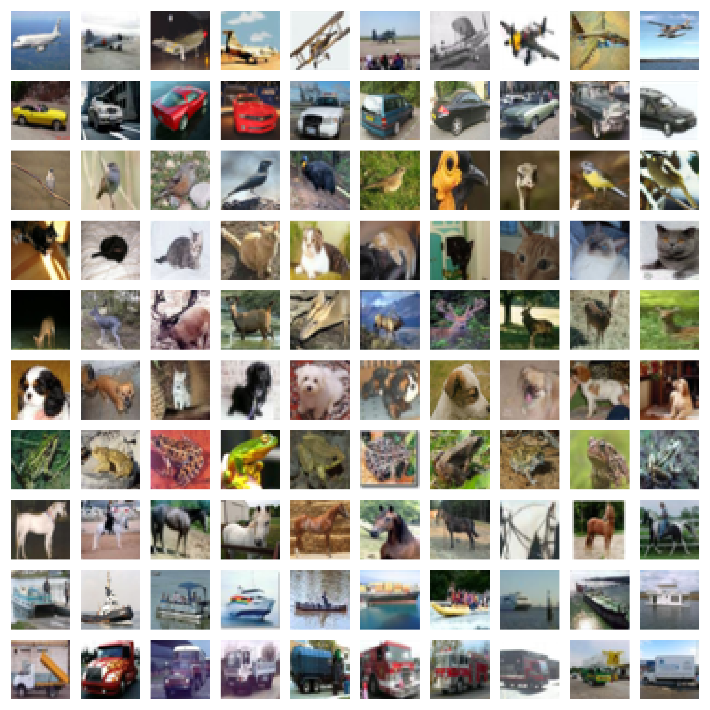
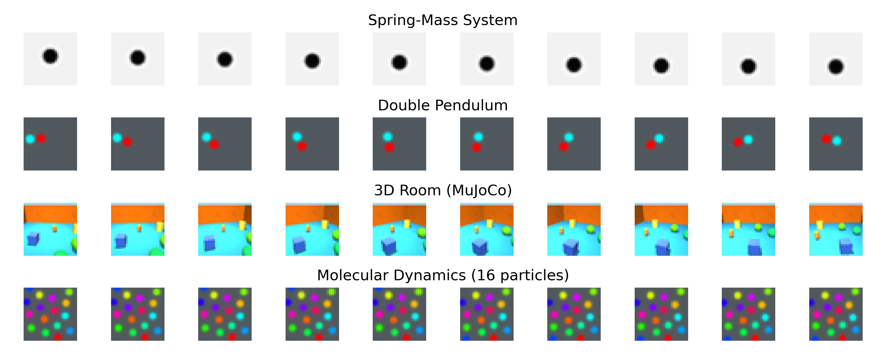
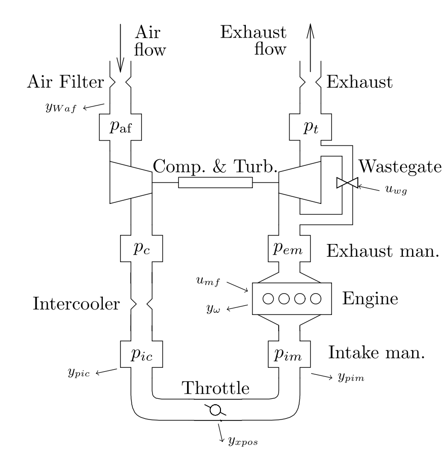
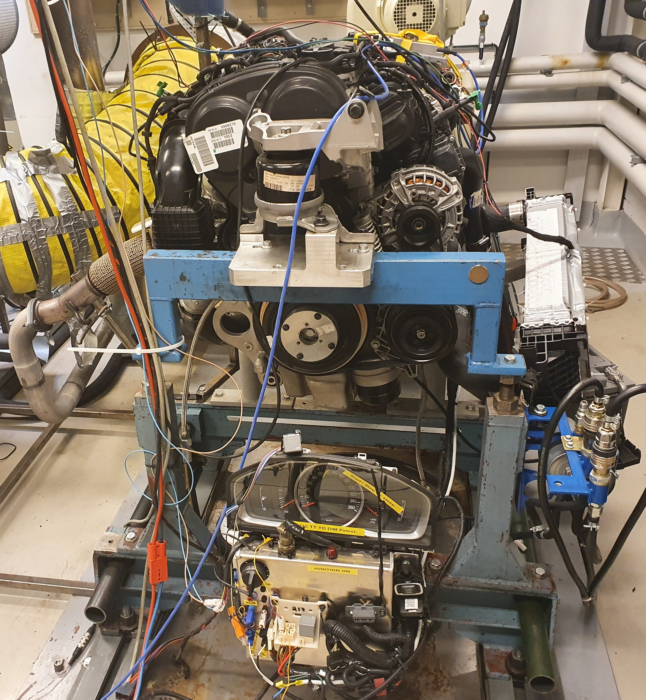
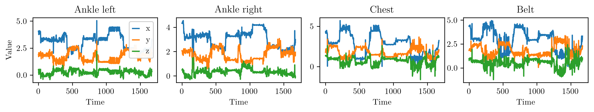
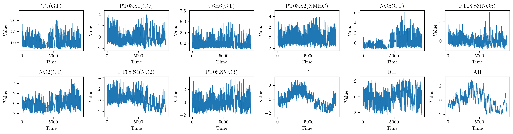

<div align="center">


______________________________________________________________________

[](https://arxiv.org/abs/2311.15890)
[](https://www.python.org/)
[](https://pytorch.org/)
[](LICENSE)
<br>
[](.github/workflows/docker-image.yml)
[](.github/workflows/apptainer-image.yml)
[](.github/workflows/conda.yml)
[](.github/workflows/mypy.yml)

</div>

[//]: # (> ### Updates)

[//]: # (>  *November 2023* :date:)

[//]: # (> - First commit.)

`neural-stability` is a repository containing the code for the paper *"Stability-Informed Initialization of Neural Ordinary Differential Equations"* by T. Westny, A. Mohammadi, D. Jung, and E. Frisk — accepted to the 2024 International Conference on Machine Learning ([ICML](https://icml.cc/Conferences/2024)).
It provides the implementation of the stability-informed initialization (SII) technique for continuous-time neural networks along with the experiments conducted in the paper.

The functionality of the repository relies heavily on [PyTorch](https://pytorch.org/docs/stable/index.html), [PyTorch Lightning](https://lightning.ai/docs/pytorch/stable/), and [torchdiffeq](https://github.com/rtqichen/torchdiffeq).

***

- [Installation](#installation)
- [Usage](#usage)
- [Datasets](#datasets)
- [Cite](#cite)

# Installation

There are several alternatives to installation, depending on your needs and preferences.
Our recommendation and personal preference is to use containers for reproducibility and consistency across different environments.
We have provided both an Apptainer and a Dockerfile for this purpose.
Both recipes use the `mamba` package manager for creating the environments. 
In both cases, they utilize an `environment.yml` file that could be used to create a local conda environment if desired.

### Hardware requirements

Depending on the experiment at hand, the original implementation make use of a considerable amount of data (some gigabytes worth) for training and testing which can be demanding for some setups.
For your reference, all code has been tried and tested on a computer with the following specs:
```
* Processor: Intel® Xeon(R) E-2144G CPU @ 3.60GHz x 8
* Memory: 32 GB
* GPU: NVIDIA Corporation TU102 [GeForce RTX 2080 Ti Rev. A]
```

<br>

### 
[Apptainer](https://apptainer.org/docs/user/main/index.html) is a lightweight containerization tool that we prefer for its simplicity and ease of use.
Once installed, you can build the container by running the following command:


```bash
apptainer build neural_stability.sif /path/to/definition_file
```

where `/path/to/definition_file` is the path to the `apptainer.def` file in the `container` folder.
Once built, it is very easy to run the container as it only requires a few extra arguments. 
For example, to start the container and execute the `train.py` script, you can run the following command from the repository root directory:

```bash
apptainer run /path/to/neural_stability.sif python train.py
```

If you have CUDA installed and want to use GPU acceleration, you can add the `--nv` flag to the `run` command.

```bash
apptainer run --nv /path/to/neural_stability.sif python train.py
```

### 
If you prefer to use [Docker](https://www.docker.com/get-started/), you can build the container by running the following command from the `container` directory:

```bash 
docker build -t neural_stability .
```

This will create a Docker image named `stability` with all the necessary dependencies.
To run the container, you can use the following command:

```bash
docker run -it neural_stability
```

Note that training using docker requires mounting the data directory to the container.
Example of how this is done from the repository root directory:

```bash
docker run -v "$(pwd)":/app -w /app neural_stability python train.py
```

To use GPU acceleration, you need to install the [NVIDIA Container Toolkit](https://docs.nvidia.com/datacenter/cloud-native/container-toolkit/install-guide.html) and run the container with the `--gpus all` flag.

```bash
docker run --gpus all -v "$(pwd)":/app -w /app neural_stability python train.py
```

### 
If you prefer to not use containers, you can create a [conda](https://conda.io/projects/conda/en/latest/index.html) environment using the `environment.yml` file.
To create the environment, run the following command:

```bash
conda env create -f /path/to/environment.yml
```
or if using [mamba](https://mamba.readthedocs.io/en/latest/)
    
```bash
mamba env create -f /path/to/environment.yml
```

This will create a new conda environment named `neural_stability` with all the necessary dependencies.
Once the environment is created, you can activate it by running:

```bash
conda activate neural_stability
```

The environment is now ready to use, and you can run the scripts in the repository.

<br>

# Usage

All experiments presented in the paper are contained within their respective folders, e.g., 'Latent Dynamics' is in the folder `latent_dynamics`.
To implement the stability-informed initialization technique, the main files of interest are:
- [stb_init.py](stb_init.py)
- [neuralode.py](models/neuralode.py)

In `stb_init.py` the initialization technique implementation as outlined in the paper is contained.
In its current form, the function that initializes the parameters of the provided model assumes the neural network is implemented using the `Sequential` module form `torch.nn`.

In `neuralode.py`, you will find the implementations of a template neural network. 
This is also where you will find functions used to perform the Jacobian calculations of the to estimate model eigenvalues.

[PyTorch Lightning](https://lightning.ai/docs/pytorch/stable/) was used to implement the training and testing behavior.
In the various `base_[experiment].py` files, the lightning-based abstractions for the different experiments are contained.
These modules are used to specify training and testing behavior.

Assuming data is available, conducting an experiment can be done using the `train.py` file with a pointer to a configuration file in an environment with the necessary libraries installed, e.g.:
```bash
python train.py --config "spring.json"
```
which will execute the training procedure for the latent dynamics model of the spring-mass system.
For your convenience, we have prepared several `[experiment].json` files with the specific set arguments for the respective experiments.
These can be found in the `configs` folder.
Additional runtime arguments, such as the number of workers, GPU acceleration, debug mode, and model checkpointing, can be specified when running the script (see [arguments.py](arguments.py) for more information).

> Note that the default logger is set to `wandb` ([weights & biases](https://wandb.ai/)) for logging performance metrics during training.
> It is our preferred tool for tracking experiments, but it can be easily replaced with other logging tools by modifying the `Trainer` in the training script.
> 
> See the official [Lightning documentation](https://lightning.ai/docs/pytorch/stable/) for more information on customizing training behavior and how to use the library in general.


<br>

# Datasets

The datasets used in this work are not included in this repository and must be obtained separately.
For all experiments, we provide the necessary code to download and preprocess the datasets.
The run scripts will automatically download and preprocess the datasets if they are not already available.
Should you wish to download the datasets manually, make sure to place them in the `data` directory.

##  Pixel-Level Image Classification
For the sequential classification tasks, [MNIST](http://yann.lecun.com/exdb/mnist/) and [CIFAR-10](https://www.cs.toronto.edu/~kriz/cifar.html) are directly available through the [torchvision](https://pytorch.org/) library.
The download and preprocessing of the datasets are handled through the provided code.

<p align="center">
   <!-- Added margin-right -->
     <!-- Added margin-right -->
  
  <br>
  <em>The leftmost figure showcases sample data from the MNIST dataset, the central figure presents samples from the permuted MNIST dataset, and the rightmost figure depicts sample data from the CIFAR-10 dataset.</em>
</p>

## Latent Dynamics
For the latent dynamics benchmarks introduced in ([Botev et al., 2021](https://arxiv.org/abs/2111.05458)), the datasets are available through the paper-provided [link](https://console.cloud.google.com/storage/browser/dm-hamiltonian-dynamics-suite) (also noted in our code).
Note that there is functionality to download the datasets directly using the code should you wish to do so.
Importantly, the datasets in their original format (`.tfrecord`) are not conveniently used with PyTorch.
Therefore, we have provided a preprocessing script that converts the datasets into `.hdf5` format.
The script is available in the `latent_dynamics` folder and is named `tf_converter_hdf5.py`.
It requires a single argument, which is the dataset of interest, for example:
```bash
python tf_converter_hdf5.py --dataset "spring"
```
A word of caution, the final datasets are quite large (several gigabytes) as opposed to the original `.tfrecord` files, but we found that these worked best for our purposes.

<p align="center">
  
  <br>
  <em>The figure provides a visual representation of the four datasets introduced by Botev et al., 2021 that were used in the paper: the Spring-mass system (Mass Spring), the Double Pendulum, Molecular Dynamics (16 particles), and the 3D Room (comprised of MuJoCo scenes). Notably, the Spring-mass system is depicted in grey scale solely for visual clarity, to distinguish it more easily from the other datasets presented.</em>
</p>

## Multivariate Time-Series Forecasting
The forecasting study utilizes three distinct datasets, briefly described below.
As these datasets are quite small compared to the other datasets used in the paper, we recommend starting with these to get a feel for the code and the experiments.

### Combustion Engine Dynamics
For the combustion engine dataset, we used the _no-fault_ data from the [LiU-ICE Industrial Fault Diagnosis Benchmark](https://vehsys.gitlab-pages.liu.se/diagnostic_competition/) available at [[download link]](https://vehsys.gitlab-pages.liu.se/diagnostic_competition/competition/training_data/trainingdata.zip).
The model is tasked with predicting the intercooler pressure using the other available measurements as inputs (except temperature).
Upon execution, the code will download the dataset and preprocess it by default.
The complete dataset is quite small (a few MBs), and the preprocessing very quick.

<p align="center">
   <!-- Added margin-right -->
  
  <br>
  <em>The figure on the left depicts the schematic of the air path through the engine (test bench shown on the right).</em>
</p>

### Localization Data for Person Activity
The Human Activity dataset is available through the [UCI Machine Learning Repository](https://archive.ics.uci.edu/dataset/196/localization+data+for+person+activity).
Data contains recordings of five people performing different activities.
Each person wore four sensors (tags) while performing the same scenario five times.
The input data to the model consists of the (x,y,z) recordings from three of the four tags (ankle left, ankle right, and belt).
The measurements belonging to the final tag (chest) are used as the ground truth target.
The data are available in `.txt` format and is preprocessed using the provided code. 
The use of the activity dataset was inspired by the work of [Rubanova et al., 2019](https://arxiv.org/abs/1907.03907).
<p align="center">
  
  <br>
  <em>Visualization of the data provided in the Human Activity dataset for subject A01.</em>
</p>

### Air Quality
The Air Quality dataset is available through the [UCI Machine Learning Repository](https://archive.ics.uci.edu/dataset/360/air+quality).
It contains the response of a gas multisensor device deployed on the field in an Italian city. Hourly responses averages are recorded along with gas concentration references from a certified analyzer.
The task associated with this dataset is a little different from the other two.
Taking in the measurements of the gas multisensor device, the model is tasked with predicting the gas concentrations references from the certified analyzer.
For simplicity, we remove Non-Metanic HydroCarbons (NMHC(GT)) from the dataset as it contains a lot of missing values.
For the remaining features, we use linear interpolation to fill in the missing values.
The data are available in `.csv` and `.xlxs` format (we use `.xlxs` ) and is preprocessed using the provided code.

<p align="center">
  
  <br>
  <em> Visualization of the data provided in the Air Quality dataset.</em>
</p>

## Cite
If you found the content of this repository useful, please consider citing the paper in your work:
```
@article{westny2023stability,
title="Stability-Informed Initialization of Neural Ordinary Differential Equations",
author={Westny, Theodor and Mohammadi, Arman and Jung, Daniel and Frisk, Erik},
journal={arXiv preprint arXiv:2311.15890},
year={2023}}
```

Feel free [email us](mailto:theodor.westny@liu.se) if you have any questions or notice any issues with the implementations.
If you have any suggestions for improvements or new features, we would be happy to hear from you.

## License
This project is licensed under the Apache License 2.0 - see the [LICENSE](LICENSE) file for details.